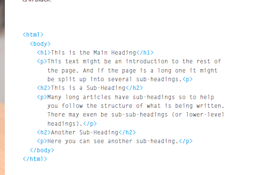

# Structure

* - the code 
Code
HTML Uses Elements
to Describe the 
Structure of Pages
<.html.>
 <.body.>
 <.h1.>This is the Main Heading</.h1>
 <.p>This text might be an introduction to the rest of 
 the page. And if the page is a long one it might 
 be split up into several sub-headings.<.p.>
 <.h.2>This is a Sub-Heading<./h.2>
 <.p>Many long articles have sub-headings so to help 
 you follow the structure of what is being written. 
 There may even be sub-sub-headings (or lower-level 
 headings).

 <.h2>Another Sub-Heading</.h2>
 <.p>Here you can see another sub-heading.<./p>
 </.body>
<./html

* -we use ( h1...p...h2..)

# Extra Markup

* -Comments in HTML
 "<!->"
If you want to add a comment 
to your code that will not be 
visible in the user's browser, you 
can add the text between these 
characters:
0<!-comment goes here -->0
It is a good idea to add 
comments to your code because, 
no matter how familiar you 
are with the page at the time 
of writing it, when you come 
back to it later (or if someone 
else needs to look at the code), 
comments will make it much 
easier to understand

*  - ID Attribute
Every HTML element can carry 
the id attribute. It is used to 
uniquely identify that element 
from other elements on the 
page. Its value should start with 
a letter or an underscore (not a 
number or any other character).
It is important that no two 
elements on the same page 
have the same value for their id
attributes (otherwise the value is 
no longer unique)
* - claas attribute
Every HTML element can 
also carry a class attribute. 
Sometimes, rather than uniquely 
identifying one element within 
a document, you will want a 
way to identify several elements 
as being different from the 
other elements on the page. 
For example, you might have 
some paragraphs of text that 
contain information that is more 
important than others and want 
to distinguish these elements, or 
you might want to differentiate 
between links that point to other 
pages on your own site and links 
that point to external sites. 
* -0 Block Elements
Some elements will always 
appear to start on a new line in 
the browser window. These are 
known as block level elements
* -Inline Elements
Some elements will always 
appear to continue on the 
same line as their neighbouring 
elements. These are known as 
inline elements

# Layout

* -Headers & Footers
* -Navigation
* -Articles
* -aside 
* - Sections
* -Heading Groups
* -Linking Around 
Block-Level Elements
