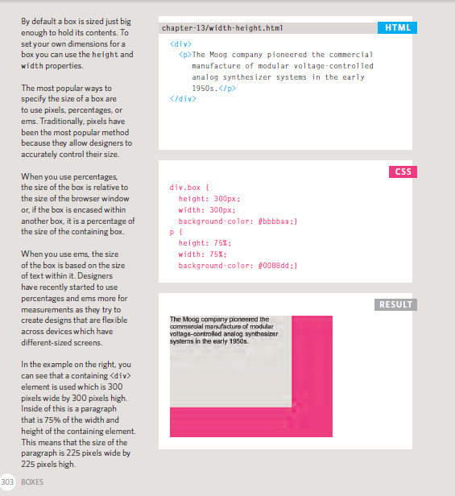

# Lists
1. Numbered lists
2. Bullet lists
3. Definition lists
##  Ordered Lists
<ol.>
The ordered list is created with
the <ol.> element.
## Unordered Lists
<ul.>
The unordered list is created
with the <ul.> element.
## Definition Lists
<dl.>
The definition list is created with
the <dl.> element and usually
consists of a series of terms and
their definitions.
Inside the <dl.> element you will
usually see pairs of <dt.> and
<dd.> elements.

## Boxes
* Controlling size of boxes
* Box model for borders, margin and padding
* Displaying and hiding boxes

# ARRAYS
1. An array is a special type of variable. It doesn't
just store one value; it stores a list of values.
2. VALUES IN ARRAYS:Values in an array are accessed as if they are in
a numbered list. It is important to know that the
numbering of this list starts at zero (not one).

## loops
1. USING IF STATEMENTS

2. SWITCH STATEMENTS