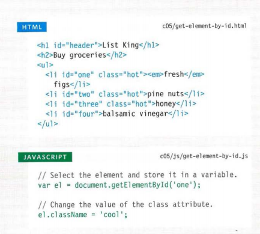

# OBJECT

* . Objects group together a set of variables and functions to create a model 
of a something you would recognize from the real world. In an object, 
variables and functions take on new names.

## object contain 

*  property( like ..user nam ...age ..)

* method (or fnction )

# The Document Object Model (DOM) specifies

how browsers should create a model of an HTML 
page and how JavaScript can access and update the 
contents of a web page while it is in the browser window
## SELECTING ELEMENTS USING ID ATTRIBUTES

### SELECTING ELEMENTS BY TAG NAME

### SELECTING ELEMENTS USING CSS SELECTORS

