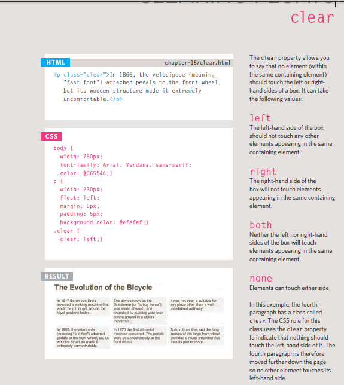

# css Layout

* -position:static
* _position:relative
* -position:absolute
* -position:fixed
* -z-index
)

## float

The float property allows you
to take an element in normal
flow and place it as far to the
left or right of the containing
element as possible.
Anything else that sits inside
the containing element will
flow around the element that is
floated

* -Using Fl oat to Pl ace
El ements Side-by-Side
* -Clearing Fl oats

