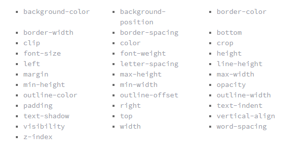

#  CSS animations:

### Transforms
With CSS3 came new ways to position and alter elements. Now general layout techniques can be revisited with alternative ways to size, position, and change elements. All of these new techniques are made possible by the transform property.

* Transform Syntax
* 2D Transforms

* 2D Rotate
* 2D Scale
* 2D Scale
* 2D Skew
# Transitions & Animations

### Transitional Property

